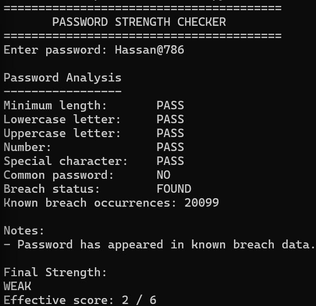
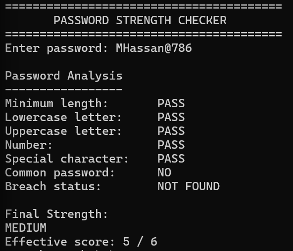
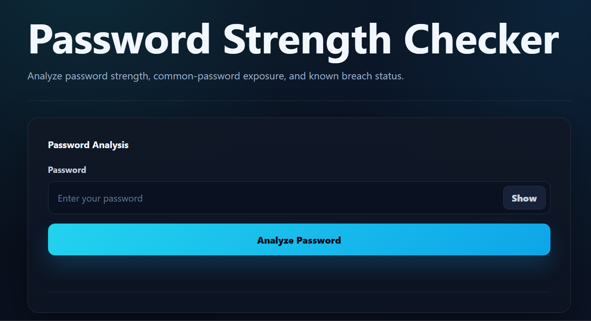
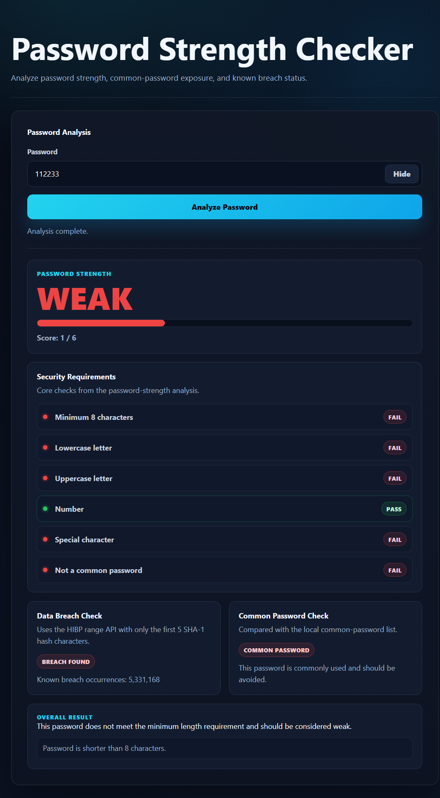
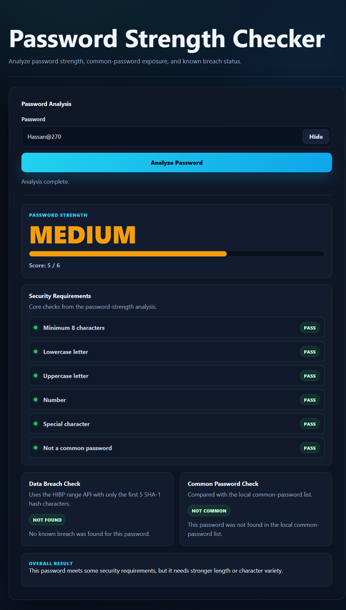
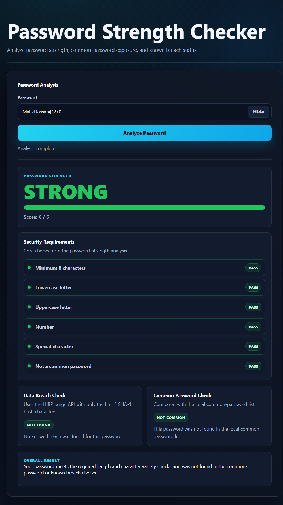

# Password Strength Checker

## Overview

Password Strength Checker is a cybersecurity project that demonstrates password validation, conditional logic, string handling, secure API usage, and beginner-friendly secure coding practices.

Live site:

```text
https://mshahzaibfarooq.github.io/password-strength-checker/
```

The project includes two complete implementations:

- `cli-version`: a pure Python terminal application
- `web-version`: a Flask web application with HTML, CSS, and vanilla JavaScript
- `docs`: a static GitHub Pages version

Both versions use the same shared password-analysis logic from `shared/password_logic.py`.

## Security Features

- Minimum length check with immediate WEAK result under 8 characters
- Lowercase, uppercase, number, and special-character checks
- Common Password Check using `data/10k-most-common.txt`
- HIBP breached-password check using k-anonymity
- Plaintext passwords are never stored, logged, or sent to HIBP
- Only the first 5 characters of the local SHA-1 hash are sent to HIBP
- Complete SHA-1 hash matching happens locally
- Local checks continue if the online breach check is unavailable

## Project Structure

```text
password-strength-checker/
├── README.md
├── .gitignore
├── data/
│   └── 10k-most-common.txt
├── shared/
│   └── password_logic.py
├── docs/
│   ├── index.html
│   ├── style.css
│   ├── script.js
│   └── data/
│       └── 10k-most-common.txt
├── cli-version/
│   ├── password_checker.py
│   └── README.md
└── web-version/
    ├── app.py
    ├── requirements.txt
    ├── README.md
    ├── templates/
    │   └── index.html
    └── static/
        ├── css/
        │   └── style.css
        └── js/
            └── script.js
```

## Password Strength Criteria

Length:

- Less than 8 characters: immediate WEAK
- 8 to 11 characters: +1 point
- 12 or more characters: +2 points

Character variety:

- Lowercase letter: +1
- Uppercase letter: +1
- Number: +1
- Special character: +1

Overrides:

- Common passwords are classified as WEAK
- Breached passwords are classified as WEAK
- The displayed score is capped to a weak-level score when a hard failure occurs

Final score:

- 0 to 3: WEAK
- 4 to 5: MEDIUM
- 6: STRONG

## Common Password Detection

The file `data/10k-most-common.txt` is a local common-password list. It is used for Common Password Check only. It is not a complete leaked-password database.

## HIBP Integration

The project uses the official Have I Been Pwned Pwned Passwords range endpoint:

```text
https://api.pwnedpasswords.com/range/{first5}
```

The password is hashed locally with SHA-1, converted to uppercase, and only the first 5 hash characters are sent to HIBP. HIBP returns hash suffixes and counts. The full hash is reconstructed and checked locally.

## Run the CLI Version

```powershell
cd D:\GitHub\Projects\password-strength-checker\cli-version
..\venv\bin\python.exe -m pip install requests
python password_checker.py
```

## Run the Web Version

```powershell
cd D:\GitHub\Projects\password-strength-checker\web-version
python -m venv venv
venv\Scripts\activate
pip install -r requirements.txt
python app.py
```

Then open:

```text
http://127.0.0.1:5000
```

## Live Demo

The `docs` folder contains a static version for GitHub Pages.

Enable it from:

```text
Repository Settings > Pages > Deploy from a branch > main > /docs
```

The GitHub Pages version runs in the browser and uses the same scoring rules.

## Screenshots

### CLI Weak Breached Password



### CLI Medium Password



### Home Screen



### Weak Password



### Medium Password



### Strong Password



## Testing

From the project root:

```powershell
.\venv\bin\python.exe -m pytest -q
```

Or from a Windows virtual environment:

```powershell
venv\Scripts\python.exe -m pytest -q
```

Tested examples include `123456`, `password`, `Password1`, `Password123!`, `Ab1!`, `abcdefgh`, `ABCDEFGH`, empty input, spaces, symbols, Unicode, very long input, HIBP timeout handling, and a long random strong password.

## Security Considerations

This is an educational password-strength analysis project. It demonstrates secure handling and breach-checking basics, but it is not a complete enterprise password-security platform.
